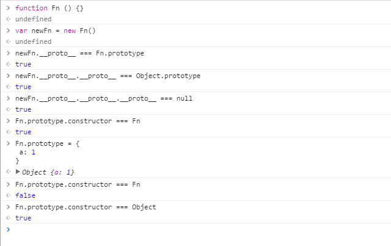
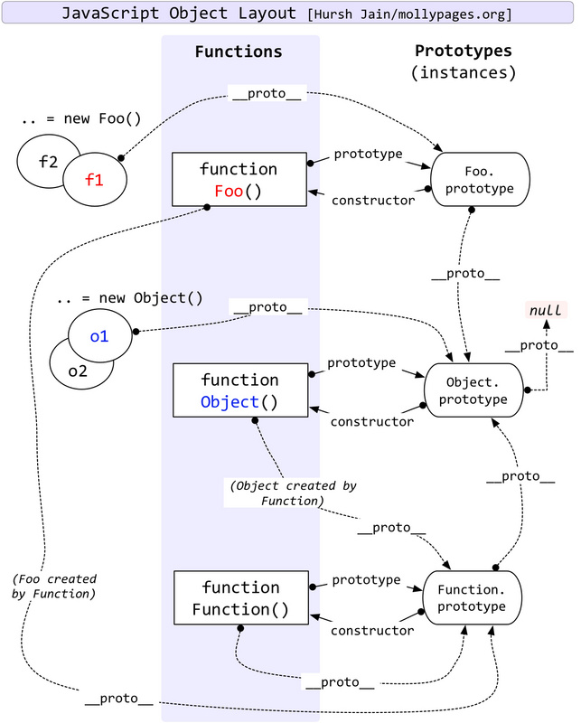
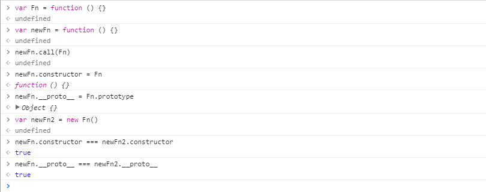
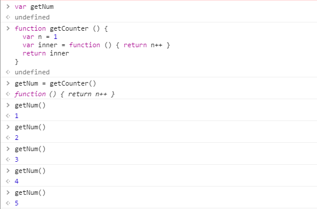
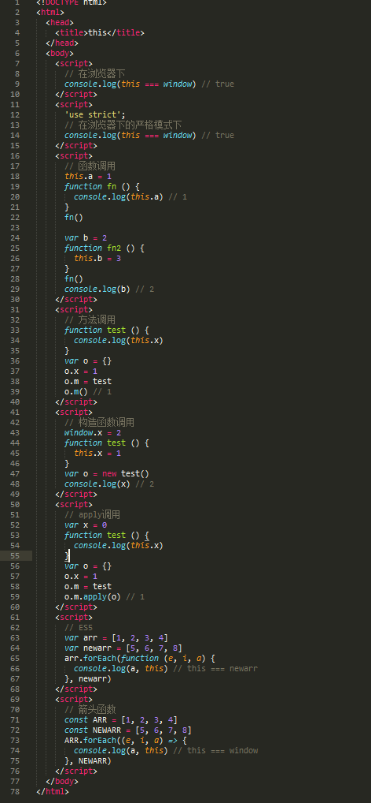

# 面向对象编程(Object Oriented Programming)

## 存在意义：摧毁编程的乐趣。。。

## 基本概念：

1. 类：类是OOP实现信息封装的基础，包含了数据说明和一组属性（静态）或行为（动态）。（不占内存）
2. 对象：指类在内存中装载的实例，具有相关的成员变量和成员函数。（占内存）

| 对象要素 |      概念      |
| :--: | :----------: |
| 对象标识 |  区别于其他对象的标识  |
| 对象状态 |  描述对象的某些特征   |
| 对象行为 | 封装对象所拥有的业务操作 |

## 四大特性：

|  特性  |                    描述                    |
| :--: | :--------------------------------------: |
|  抽象  | 抽象是通过特定的实例抽取共同特征以后形成概念的过程。抽象是不足以完整描述一个对象的类，但具有一个类所需的核心的特征。抽象只关注与当前目标有关的方面。 |
|  封装  |       隐藏内部实现细节，实现组件的**“高内聚，低耦合”**。       |
|  继承  |            使某对象继承另一对象的属性和行为。             |
|  多态  |     由继承而产生的相关的不同的类，其对象对同一消息会做出不同的响应。     |

## 五大基本原则(S.O.L.I.D)：

|                    原则                    |                    说明                    |
| :--------------------------------------: | :--------------------------------------: |
| 单一职责原则SRP(Single Responsibility Principle) |            一个类只负责一个操作，功能要单一。             |
|     开放封闭原则OCP(Open－Close Principle)      |           对象或实体应该对扩展开放，对修改封闭。            |
| 里氏替换原则LSP(the Liskov Substitution Principle LSP) |        子类应当可以替换父类并出现在父类能够出现的任何地方。        |
| 依赖倒置原则DIP(the Dependency Inversion Principle DIP) | 实体必须依靠抽象而不是具体实现。它表示高层次的模块不应该依赖于低层次的模块，它们都应该依赖于抽象。 |
| 接口隔离原则ISP(the Interface Segregation Principle ISP) |           客户端不应该被迫依赖它们不使用的方法。            |

## OOP IN JS

### JavaScript 中几乎所有的对象都是位于原型链顶端的`Object`的实例。

### 基础概念：

1. `Object`:  `Object` 构造函数创建一个对象包装器。

2. `{}`:  `{} === new Object() `

3. `Object.prototype`  `Object.prototype` 属性表示 `Object` 的原型对象。`Object.prototype` 是顶级对象，所有对象都继承自它。

   | `Object.prototype` 属性 |  状态   |
   | :-------------------: | :---: |
   |       writable        | false |
   |      enumerable       | false |
   |     configurable      | false |

4. `Object.prototype.constructor`: 返回创建实例对象的 `Object` 构造函数的引用。此属性的值是对函数本身的引用，而不是一个包含函数名称的字符串。所有对象都会从它的原型上继承一个 `constructor` 属性。

   **注意：当重写`prototype`的时候，`constructor`会消失，需要手动添加**

5. `Object.prototype.__proto__`: 每个对象都有一个`__proto__`属性,相当于一个指针，可以指向某原型对象，并且引用其属性及方法。

6. `[[prototype]]`:  每个对象都有的私有属性，它持有一个连接到另一个称为其 `prototype`对象的链接。

7. `new`:  `new`运算符创建一个用户定义的对象类型的实例或具有构造函数的内置对象类型之一。

### 原型链：

定义：每个对象都有都有自己的原型对象，而原型对象又有自己的原型，这样就组成了一条链条 —— 原型链，JS引擎在访问对象属性时，如果对象本身没有，就会去原型链中查找，如果找到就直接返回值，如果整个链条遍历都没有找到属性，就返回undefined。

如上图：

1. `Object.prototype`是顶级对象，所有对象都继承自它。
2. `Function` 继承 `Function` 本身， `Function.prototype` 继承 `Object.prototype` 。
3. `Function.prototype` 和 `Function.__proto__` 都指向 `Function.prototype`
4. `Object.prototype.__proto__` === `null` ，说明原型链到 `Object.prototype` 终止。

#### 资料来源于：

[Javascript重温OOP之原型与原型链](https://segmentfault.com/a/1190000006118638)

[继承与原型链](https://developer.mozilla.org/zh-CN/docs/Web/JavaScript/Inheritance_and_the_prototype_chain)

### new 创建对象的过程：

1. 先创建空对象
2. 然后`this`指向这个对象
3. 给这个空对象构造出你原函数里的方法跟属性（不可继承的除外）
4. 给这个空对象添加`__proto__`，然后再指向原函数的`prototype`

### 闭包(Closures)：

#### 概念：闭包就是能够读取其他函数内部变量的函数。

#### 最大用处：

1.  可以读取函数内部的变量
2.  让这些变量的值始终保持在内存中
3.  写轮子（反复使用）

#### 弊端：

1. 占用更多的内存
2. 不易释放

#### 例子：

资料来源于：

[学习Javascript闭包（Closure）](http://www.ruanyifeng.com/blog/2009/08/learning_javascript_closures.html)

[图解JS闭包](https://zhuanlan.zhihu.com/p/27857268)

[“动静结合” 小白初探静态(词法)作用域，作用域链与执行环境(EC)](https://segmentfault.com/a/1190000004907656)

### this

#### 概念：this是JS的一个关键字，代表程序运行时自动生成的一个内部对象。

#### 不同场景下：

1. node

2. window

