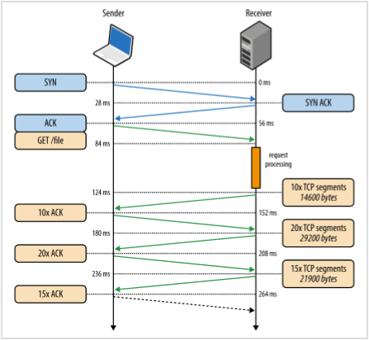
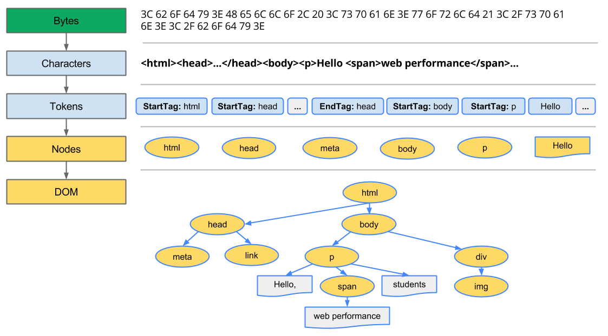
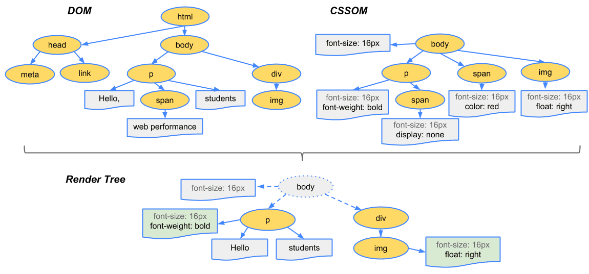

# 浏览器渲染页面的过程

**先行说明：本文档是以[前端工程师应掌握的网络知识](https://segmentfault.com/l/1500000009674437/play)以及[浏览器的渲染：过程与原理](https://juejin.im/post/59f1cd855188252c224d3b4e)为蓝本进行的总结**

## 1. DNS解析 (100 ~ 200ms 可缓存)

### 网域名称系统（Domain Name System，DNS）：

是 互联网的一项服务。它作为将域名和IP地址相互映 射的一个分布式数据库，能够使人更方便地访问互联网。


### 过程：

**以www.baidu.com为例**

1. 本机向local dns请求www.baidu.com
2. local dns向根域请求www.baidu.com，根域返回com.域的服务器IP
3. 向com.域请求www.baidu.com，com.域返回baidu.com域的服务器IP
4. 向baidu.com请求www.baidu.com，返回cname www.a.shifen.com和a.shifen.com域的服务器IP
5. 向root域请求www.a.shifen.com
6. 向com.域请求www.a.shife.com
7. 向shifen.com请求
8. 向a.shifen.com域请求
9. 拿到www.a.shifen.com的IP
10. localdns返回本机www.baidu.com cname www.a.shifen.com 以及 www.a.shifen.com的IP


相关链接：

1. [DNS解析的过程是什么，求详细的？](https://www.zhihu.com/question/23042131)
2. [DNS解析过程详解](http://blog.chinaunix.net/uid-28216282-id-3757849.html) 


### DNS缓存：

浏览器缓存和操作系统(OS)缓存。在浏览器中访问的时候，会优先访问浏览器缓存，如果未命中则访问OS缓存，最后再访问DNS服务器(一般是ISP提供)，然后DNS服务器会递归式的查找域名记录，然后返回。DNS记录会有一个ttl值(time to live)，单位是秒，意思是这个记录最大有效期是多少。经过实验，OS缓存会参考ttl值，但是不完全等于ttl值，而浏览器DNS缓存的时间跟ttl值无关，每种浏览器都使用一个固定值。 


## 2. TCP连接 (三次握手 四次挥手)

### 三次握手的过程：

1. 客户端发送一个SYN包给服务器，然后等待应答。
2. 服务器端回应给客户端一个ACK=1、SYN=1的TCP数据段。
3. 客户必须再次回应服务器端一个ACK确认数据段。


### 四次挥手的过程：

1. TCP客户端发送一个FIN，关闭客户端到服务器端的数据传送。（客户端不再发送报文给服务器端，但可接受服务器端报文）
2. 服务器收到这个FIN，它发回一个ACK，确认序号为收到的序号加1。
3. 服务器关闭客户端的连接，发送一个FIN给客户端。（服务器端关闭到客户端的数据传送）
4. 客户段发回ACK报文确认，并将确认序号设置为收到序号加1。





相关链接：

1. [TCP建立连接与释放连接](https://www.2cto.com/net/201307/231072.html)


## 3. HTTP请求 (半个RTT)

### 格式：请求行、请求头、空行、消息体。每部分内容占一行


1. 请求行：请求行是请求消息的第一行，由三部分组成：分别是请求方法（GET/POST/DELETE/PUT/HEAD）、请求资源的URI路径、HTTP的版本号

   ```
   GET /index.html HTTP/1.1
   ```

2. 请求头：请求头中的信息有和缓存相关的头（Cache-Control，If-Modified-Since）、客户端身份信息（User-Agent）等等。

   ```
   Cache-Control:max-age=0
   Cookie:gsScrollPos=; _ga=GA1.2.329038035.1465891024; _gat=1
   If-Modified-Since:Sun, 01 May 2016 11:19:03 GMT
   User-Agent:Mozilla/5.0 (Windows NT 10.0; WOW64) AppleWebKit/537.36 (KHTML, like Gecko) Chrome/51.0.2704.84 Safari/537.36
   ```

3. 空行：...隔行

4. 消息体：请求体是客户端发给服务端的请求数据，这部分数据并不是每个请求必须的。

   ​

## 4. HTTP响应 (RTT不确定)

### 格式：状态行、响应头、空行、消息体。每部分内容占一行。


1. 状态行：状态行位于相应消息的第一行，有HTTP协议版本号，状态码和状态说明三部分构成。

   ```
   HTTP/1.1 200 OK
   ```

2. 响应头：响应头是服务器传递给客户端用于说明服务器的一些信息，以及将来继续访问该资源时的策略。

   ```Connection:keep-alive
   Connection:keep-alive
   Content-Encoding:gzip
   Content-Type:text/html; charset=utf-8
   Date:Fri, 24 Jun 2016 06:23:31 GMT
   Server:nginx/1.9.12
   Transfer-Encoding:chunked
   ```

3. 响应体：响应体是服务端返回给客户端的HTML文本内容，或者其他格式的数据。


## 客户端渲染

1. 处理HTML来创建DOM tree
2. 处理CSS来创建CSSOM tree
3. 根据DOM跟CSSOM来合并render tree
4. 根据render tree来布局
5. 绘制render tree








相关链接：

[How browsers work](http://taligarsiel.com/Projects/howbrowserswork1.htm)

[How Browsers Work: Behind the scenes of modern web browsers](https://www.html5rocks.com/en/tutorials/internals/howbrowserswork/#The_browsers_we_will_talk_about)

**ps：**这是一段好复杂的概念。。。网上找的文档解析起来都好长，看着眼睛疼 ...(｡･ˇ_ˇ･｡)


## 备注：

### RTT(Round-Trip Time) : 往返时延。 

### **解释** : 

在计算机网络中它是一个重要的性能指标，表示从发送端发送数据开始，到发送端收到来自接收端的确认（接收端收到数据后便立即发送确认），总共经历的时延。


### 决定因素：

1. 链路的传播时间
2. 末端系统的处理时间
3. 路由器的缓存中的排队和处理时间


### 总结：

其中，前面两个部分的值作为一个TCP连接相对固定，路由器的缓存中的排队和处理时间会随着整个[网络拥塞](https://baike.baidu.com/item/%E7%BD%91%E7%BB%9C%E6%8B%A5%E5%A1%9E)程度的变化而变化。所以RTT的变化在一定程度上反映了网络拥塞程度的变化。简单来说就是发送方从发送数据开始，到收到来自接受方的确认信息所经历的时间。


### TCP/IP协议族的构成


相关链接：

1. [TCP/IP协议簇分层详解](http://blog.csdn.net/u010796790/article/details/51871783)
2. [TCP/IP协议族](https://segmentfault.com/a/1190000011265376)